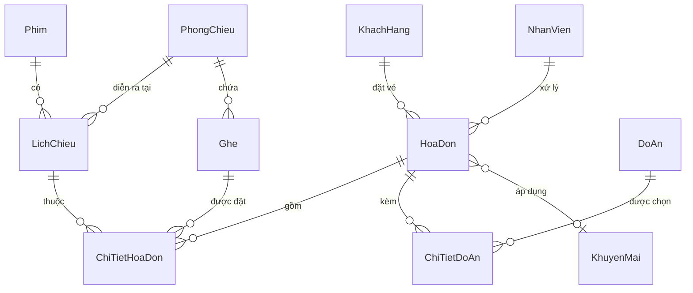

# Cinema Management System

> **Đồ án môn học Lập trình Cơ sở dữ liệu** — Hệ thống quản lý rạp chiếu phim toàn diện, xây dựng trên nền tảng ASP.NET Core MVC theo kiến trúc **3 lớp (3-Tier Architecture)**, tích hợp nhiều công nghệ hiện đại như **SignalR**, **VNPay**, **Google OAuth 2.0** và **QR Code**.

---

## Mục lục

- [Tính năng nổi bật](#-tính-năng-nổi-bật)
- [Công nghệ sử dụng](#-công-nghệ-sử-dụng)
- [Kiến trúc dự án](#-kiến-trúc-dự-án)
- [Sơ đồ CSDL](#-sơ-đồ-cơ-sở-dữ-liệu)
- [Kỹ thuật T-SQL trọng tâm](#-kỹ-thuật-t-sql--csdl-trọng-tâm)
- [Hướng dẫn cài đặt](#-hướng-dẫn-cài-đặt--chạy-dự-án)
- [Tài khoản mặc định](#-tài-khoản-mặc-định)
- [Tác giả](#-tác-giả)

---

## Tính năng nổi bật

### Dành cho Khách hàng

| Tính năng                 | Mô tả                                                                                                  |
| :------------------------ | :----------------------------------------------------------------------------------------------------- |
| **Xác thực hiện đại**     | Đăng ký / Đăng nhập an toàn (mật khẩu mã hóa BCrypt), hỗ trợ **đăng nhập bằng Google OAuth 2.0**       |
| **Đặt vé trực tuyến**     | Xem phim đang chiếu & sắp chiếu, lọc lịch chiếu theo ngày/giờ, tải nhanh nhờ **IMemoryCache**          |
| **Sơ đồ ghế real-time**   | Chọn ghế trực quan, tự động sinh theo sức chứa phòng chiếu, **đồng bộ khóa ghế real-time qua SignalR** |
| **Dịch vụ đi kèm**        | Chọn bắp, nước, combo trực tiếp trong quy trình đặt vé                                                 |
| **Thanh toán VNPay**      | Tích hợp cổng thanh toán **VNPay Sandbox** an toàn, nhanh chóng                                        |
| **Vé điện tử (E-Ticket)** | Nhận vé điện tử kèm **mã QR** ngay sau thanh toán thành công                                           |
| **Quản lý cá nhân**       | Xem hồ sơ, lịch sử giao dịch, đổi mật khẩu. Giao diện mượt mà với hoạt ảnh **GSAP**                    |

### Dành cho Quản trị viên (Admin)

| Tính năng              | Mô tả                                                                                   |
| :--------------------- | :-------------------------------------------------------------------------------------- |
| **Quản lý Phim**       | CRUD phim với upload poster, quản lý thể loại, thời lượng                               |
| **Phòng chiếu & Ghế**  | Thiết lập phòng chiếu, tự động sinh sơ đồ ghế theo sức chứa                             |
| **Suất chiếu**         | Sắp xếp lịch chiếu thông minh, tự động tính giờ kết thúc theo thời lượng phim           |
| **Quản lý Dịch vụ**    | CRUD combo bắp nước / đồ ăn / thức uống                                                 |
| **Quản lý Khuyến mãi** | Tạo & quản lý chương trình giảm giá (% giảm, điều kiện áp dụng, thời hạn hiệu lực)      |
| **Quản lý Nhân viên**  | CRUD thông tin nhân viên, phân quyền                                                    |
| **Quản lý Khách hàng** | Xem, sửa, xóa thông tin khách hàng                                                      |
| **Thống kê & Báo cáo** | Dashboard tổng quan, biểu đồ doanh thu theo phim (Chart.js), **xuất Excel** (ClosedXML) |

### Dành cho Nhân viên

| Tính năng            | Mô tả                                                     |
| :------------------- | :-------------------------------------------------------- |
| **Dashboard riêng**  | Khu vực quản lý riêng biệt với phân quyền rõ ràng         |
| **Quản lý nội dung** | Quản lý phim, suất chiếu, dịch vụ trong phạm vi quyền hạn |
| **Xem báo cáo**      | Theo dõi doanh thu                                        |

---

## Công nghệ sử dụng

| Lĩnh vực              | Công nghệ / Thư viện                                            |
| :-------------------- | :-------------------------------------------------------------- |
| **Framework**         | ASP.NET Core MVC (.NET 8.0)                                     |
| **Kiến trúc**         | 3-Layer Architecture (Presentation → BUS → DAL)                 |
| **Cơ sở dữ liệu**     | Microsoft SQL Server (T-SQL)                                    |
| **Data Access**       | Entity Framework Core 8.0, ADO.NET (`SqlDataReader`, `DataSet`) |
| **Truy vấn & Export** | LINQ to Objects, LINQ to Entities, LINQ to XML                  |
| **Giao diện (UI)**    | Razor Views, Bootstrap 5, jQuery, SweetAlert2, Chart.js, GSAP   |
| **Real-time**         | ASP.NET Core SignalR                                            |
| **Bảo mật**           | BCrypt.Net, Google OAuth 2.0, Session-based Authentication      |
| **Thanh toán**        | VNPay Sandbox API                                               |
| **Tối ưu**            | IMemoryCache (Cache danh sách phim)                             |
| **Báo cáo**           | ClosedXML (Xuất báo cáo Excel)                                  |
| **Kiểm thử**          | xUnit, Moq (20+ Unit Tests bao phủ tầng BUS)                    |

---

## Kiến trúc dự án

```text
CinemaManagementSystem/
│
├── Cinema.DAL/                    #   Data Access Layer
│   ├── Models/                    #    14 Entity classes + DbContext
│   │   ├── QuanLyRapPhimContext   #    EF Core DbContext (Database First)
│   │   ├── Phim, LichChieu, Ghe  #    Các bảng chính
│   │   ├── HoaDon, ChiTietHoaDon #    Hóa đơn & Chi tiết
│   │   ├── KhuyenMai, DoAn       #    Khuyến mãi & Dịch vụ
│   │   └── VwDoanhThuTheoPhim    #    View thống kê doanh thu
│   ├── AdoNet/                    #    ADO.NET (ICinemaAdoNetDAL)
│   └── Migrations/                #    EF Core Migrations
│
├── Cinema.BUS/                    #   Business Logic Layer
│   ├── IPhimBUS / PhimBUS         #    7 Interface + 7 Implementation
│   ├── IHoaDonBUS / HoaDonBUS     #    Xử lý nghiệp vụ đặt vé, thanh toán
│   ├── IKhuyenMaiBUS / ...        #    Quản lý khuyến mãi
│   └── ...                        #    NhanVien, KhachHang, DoAn, PhongChieu
│
├── Cinema.DTO/                    #   Data Transfer Objects
│   ├── PhimDTO, HoaDonDTO         #    DTO trao đổi giữa các lớp
│   ├── KhuyenMaiDTO, GheDTO       #    Tách biệt Entity và View Model
│   └── ...                        #
│
├── Cinema.Web/                    #   Presentation Layer (ASP.NET Core MVC)
│   ├── Controllers/               #    6 Controllers (Account, Phim, HoaDon, ...)
│   ├── ApiControllers/            #    3 RESTful API (PhimApi, DichVuApi, LichChieuApi)
│   ├── Hubs/                      #    SignalR Hub (SeatHub - đồng bộ ghế real-time)
│   ├── Areas/
│   │   ├── Admin/                 #     Admin Area (9 Controllers)
│   │   │   ├── Home, Phim         #    Dashboard, Quản lý phim
│   │   │   ├── PhongChieu, SuatChieu  # Phòng chiếu & Lịch chiếu
│   │   │   ├── DichVu, KhuyenMai #    Dịch vụ & Khuyến mãi
│   │   │   ├── NhanVien, KhachHang #   Nhân sự & Khách hàng
│   │   │   └── DoanhThu          #    Thống kê & Báo cáo
│   │   └── NhanVien/              #     Nhân viên Area (5 Controllers)
│   ├── Views/                     #    Razor Views
│   └── wwwroot/                   #    Static files (CSS, JS, Images)
│
├── Cinema.Tests/                  #  Unit Testing (xUnit + Moq)
│   ├── PhimBUSTests               #    Test nghiệp vụ phim
│   ├── NhanVienBUSTests           #    Test nghiệp vụ nhân viên
│   ├── DoAnBUSTests               #    Test nghiệp vụ dịch vụ
│   └── PhongChieuBUSTests         #    Test nghiệp vụ phòng chiếu
│
├── DatabaseScripts/               #   T-SQL Scripts
│   └── CinemaManagementSystem_Full.sql  # Script hợp nhất (Schema + Seed Data)
│
└── HashTool/                      #  Công cụ tạo hash BCrypt
```

---

## Sơ đồ Cơ sở dữ liệu



**Các bảng chính:** `Phim`, `PhongChieu`, `Ghe`, `LichChieu`, `KhachHang`, `NhanVien`, `HoaDon`, `ChiTietHoaDon`, `DoAn`, `ChiTietDoAn`, `KhuyenMai`, `NhatKyHeThong`

---

## Kỹ thuật T-SQL & CSDL trọng tâm

| Kỹ thuật             | Chi tiết                                                                          |
| :------------------- | :-------------------------------------------------------------------------------- |
| **Database Script**  | Hợp nhất schema + seed data trong `CinemaManagementSystem_Full.sql`               |
| **View**             | `vw_DoanhThuTheoPhim` — Thống kê doanh thu phục vụ biểu đồ và xuất Excel          |
| **Stored Procedure** | `sp_LayDanhSachPhimDangChieu` — Lấy phim đang chiếu theo ngày                     |
| **Function**         | Scalar Function tính tổng tiền hóa đơn                                            |
| **Trigger**          | `trg_NganXoaHoaDonCoCTHD` — Ngăn xóa hóa đơn đã có chi tiết                       |
| **Transaction**      | `BeginTransaction` đảm bảo tính nguyên tử khi thanh toán (Hóa đơn + Vé + Dịch vụ) |

---

## Hướng dẫn Cài đặt & Chạy dự án

### Yêu cầu hệ thống

- [.NET 8.0 SDK](https://dotnet.microsoft.com/download/dotnet/8.0) trở lên
- [SQL Server](https://www.microsoft.com/en-us/sql-server/sql-server-downloads) (Express hoặc Developer)
- Visual Studio 2022 (khuyên dùng) hoặc VS Code

### Các bước khởi chạy

**1. Clone dự án**

```bash
git clone https://github.com/gnuttt212/CinemaManagementSystem.git
cd CinemaManagementSystem
```

**2. Khởi tạo Database**

- Mở **SQL Server Management Studio (SSMS)**.
- Tạo Database mới tên `QuanLyRapPhim`.
- Mở file `DatabaseScripts/CinemaManagementSystem_Full.sql` → Nhấn **F5** để thực thi.
- Script sẽ tự động tạo toàn bộ bảng, View, Stored Procedure, Trigger và dữ liệu mẫu.

**3. Cấu hình Connection String**

Mở `Cinema.Web/appsettings.json` và cập nhật `DefaultConnection` cho phù hợp:

```json
{
  "ConnectionStrings": {
    "DefaultConnection": "Server=TEN_MAY\\SQLEXPRESS;Initial Catalog=QuanLyRapPhim;Integrated Security=True;TrustServerCertificate=True"
  }
}
```

**4. Cấu hình Google OAuth **

```bash
cd Cinema.Web
dotnet user-secrets init
dotnet user-secrets set "Authentication:Google:ClientId" "YOUR_CLIENT_ID"
dotnet user-secrets set "Authentication:Google:ClientSecret" "YOUR_CLIENT_SECRET"
```

**5. Build & Chạy**

```bash
dotnet build
cd Cinema.Web
dotnet run
```

**6. Chạy Unit Tests**

```bash
dotnet test Cinema.Tests
```

### Đường dẫn truy cập

| Vai trò    | URL                               |
| :--------- | :-------------------------------- |
| Khách hàng | `https://localhost:7059/`         |
| Admin      | `https://localhost:7059/Admin`    |
| Nhân viên  | `https://localhost:7059/NhanVien` |

---

## Tài khoản mặc định

> Các tài khoản test được tạo sẵn trong Database Script.

| Vai trò    | Tài khoản                                        | Ghi chú             |
| :--------- | :----------------------------------------------- | :------------------ |
| Admin      | Xem trong file `CinemaManagementSystem_Full.sql` | Toàn quyền quản trị |
| Nhân viên  | Xem trong file `CinemaManagementSystem_Full.sql` | Quyền hạn giới hạn  |
| Khách hàng | Tự đăng ký hoặc đăng nhập Google                 | —                   |

---

## Giấy phép

Dự án này được phát triển phục vụ mục đích học tập trong khuôn khổ môn Lập trình Cơ sở dữ liệu.

---

## Tác giả

**Trần Thanh Tung** — MSSV: 2351010232
Năm học 2025–2026
