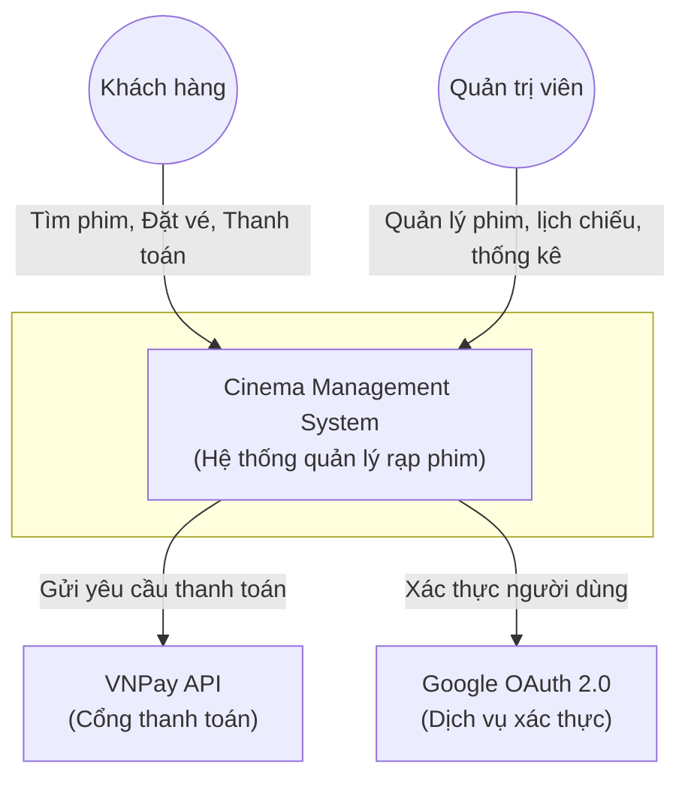
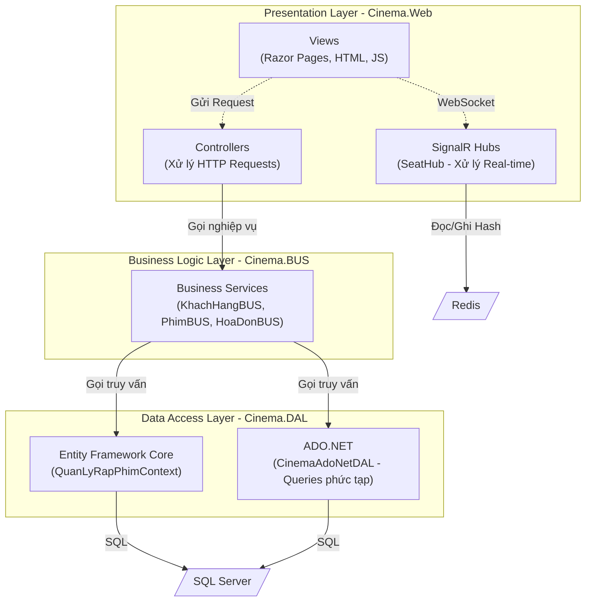

# Sơ đồ Kiến trúc C4 - Cinema Management System

Tài liệu này mô tả kiến trúc của hệ thống theo mô hình C4 (Context, Container) để cung cấp cái nhìn tổng quan từ người dùng đến các thành phần kỹ thuật.

## 1. Context Diagram (Ngữ cảnh hệ thống)

Sơ đồ này thể hiện hệ thống Cinema Management ở mức tổng quan nhất, cùng với người dùng và các hệ thống bên ngoài mà nó tương tác.



## 2. Container Diagram (Mức Container)

Sơ đồ này đi sâu vào bên trong `Cinema Management System` để xem nó được cấu tạo từ các ứng dụng và nơi lưu trữ dữ liệu nào.

```mermaid
graph TD
    %% Actors
    Customer((Khách hàng))
    Admin((Quản trị viên))

    %% External Systems
    VNPay["VNPay API"]
    GoogleAuth["Google OAuth"]
    
    subgraph CinemaSystem [Cinema Management System]
        WebApp["Web Application\n(ASP.NET Core 8 MVC)"]
        
        DB[/"SQL Server Database\n(Lưu trữ dữ liệu lõi)"/]
        Redis[/"Redis\n(Distributed Cache, Session, SignalR Backplane)"/]
        MinIO[/"MinIO Object Storage\n(Lưu trữ Poster Phim)"/]
        
        BackgroundWorker["Cinema Backup\n(Cron Job / Bash Script)"]
    end

    %% Relationships
    Customer -->|HTTPS / WSS (SignalR)| WebApp
    Admin -->|HTTPS| WebApp
    
    WebApp -->|Đọc/Ghi dữ liệu (EF Core)| DB
    WebApp -->|Lưu Session, Khóa ghế real-time| Redis
    WebApp -->|Upload/Download hình ảnh| MinIO
    
    WebApp -->|Xác thực token| GoogleAuth
    WebApp -->|Tạo giao dịch| VNPay
    
    BackgroundWorker -->|Dump DB hàng ngày| DB
```

## 3. Component Diagram (Mức Thành phần - Ứng dụng Web)

Sơ đồ này mô tả cấu trúc bên trong của ứng dụng Web ASP.NET Core (Kiến trúc 3 lớp).


